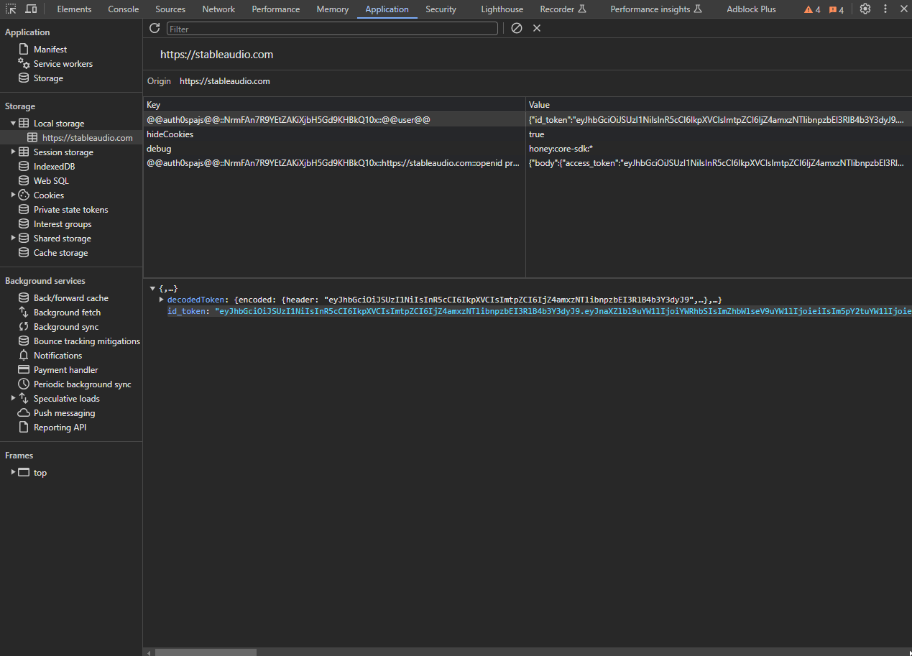

# Stable Audio 2 API

Access Stable Audio 2 for absolutely free using this reverse engineered API!

## How to use?

In order to use this API, you need to first make sure you have Node.JS installed on your machine. Alternatively, you may use an online IDE like [Repl.it](https://replit.com) to run the code.

Then, follow the steps below:

1. Obtaining your Stable Audio token. Scroll down to view how
2. Once you have your token, set it in the token.json file accordingly.
3. The `stable_audio.js` file contains the core functionality in the form of a function which has been exported. You may access it like this:

    ```js
    const { generateAudio } = require('./stable_audio');

    const main = async () => {
        await generateAudio('electronic dance music', 180, 123); // Prompt (required) | Length (optional) | Seed (optional)
    };

    main();
    ```

4. Run the file using `node index.js`.
4. There you have it! Once you run the file, it will download to audio_file.mp3 in the same directory for you to listen to. You may adjust the function if you would like to download it in another location.

## How to get my Stable Audio Token?

1. Visit https://stableaudio.com/generate and register for an account.
2. Open up your browser developer tools (Chrome - `Ctrl` + `Shift` + `I`)
3. Navigate to the "Application" tab.
4. Under `Local Storage` -> `https://stableaudio.com` there should be something that looks like this: `@@auth0spajs@@::XxXxX12345::@@user@@`.
5. Copy the value under `id_token`.
6. Then set it in the token.json file accordingly.

